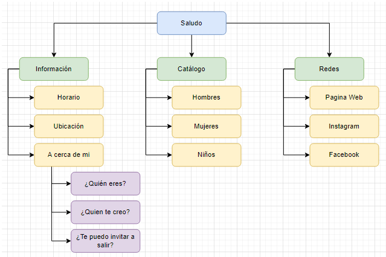

# Proyecto Final - Proyecto BooBot

## Integrantes:
- Jesús Raúl Alvarado Torres - [@RaulAlvaradoT](https://github.com/RaulAlvaradoT)
- Isaac Adrian Cisneros Garcia - [@IsaacElCrack](https://github.com/IsaacElCrack)
- Manuel Gerardo Morales Ramos - [@gera9](https://github.com/gera9)

## Utilizamos:
- [Visual Studio Code](https://code.visualstudio.com)
- [NodeJS](https://nodejs.org/es)

## Documentación:
- [Visual Studio Code](https://code.visualstudio.com/docs)
- [NodeJS](https://nodejs.org/es/docs/)

## Diagrama:

